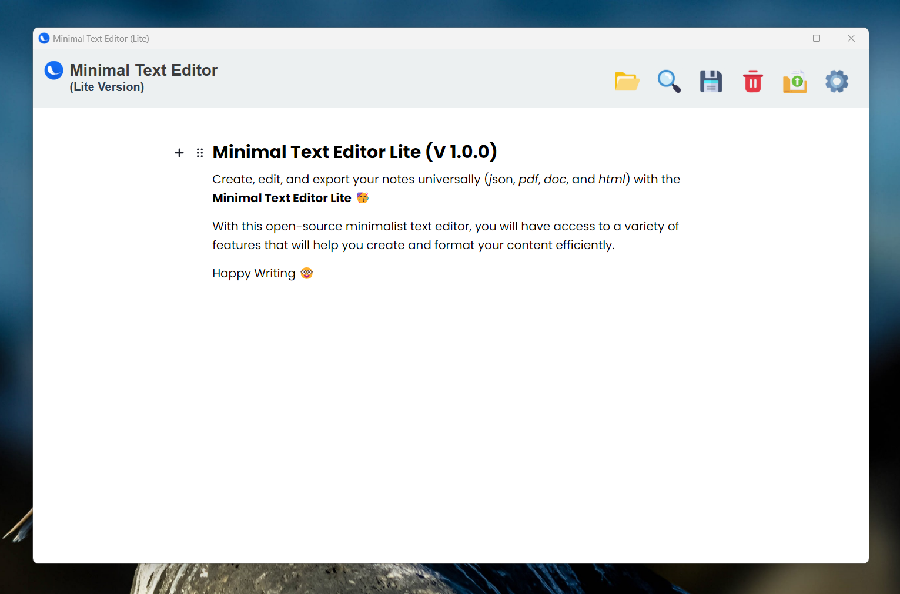

  

<h1 align="center">
  Minimal Text Editor (Lite) For Windows
</h1>

  Create notes and export them in universal format :)

  

# Minimal Text Editor (Lite) 
With **Minimal Text Editor (Lite)**, you can create, save and organize your notes in several different formats (json, pdf, doc and html). Your notes are saved automatically, where you can set such saves from time to time. With this app, you will be able to create your notes using structured blocks, with support for:

- Headers
- Paragraphs
- Images
- Checklists
- Lists (ordered and unordered)
- Quotes
- Code blocks
- Tables
- Links
- Embeds (e.g., videos, tweets)
- Delimiters
- Raw HTML

The idea is that you can export your notes in JSON format, allowing other applications to interpret them universally, and thus organize your note with customized layouts (which were defined by your application).

Additionally, you can open your notes within the application (as long as they are in JSON format). You can download the executable installer in your [homepage](https://micilini.com/apps/mte-lite).

## How to runs this application locally?

This application was made using the following technologies:

- C#
- Windows Presentation Foundation (WPF)
- Python
- ReactJS
- SQLite

In conjunction with the following libraries:

- [Editor.js](https://editorjs.io/)
- [InputSimulator](https://github.com/michaelnoonan/inputsimulator)  
- [MaterialDesignThemes](https://github.com/MaterialDesignInXAML/MaterialDesignInXamlToolkit)  
- [WebView2](https://learn.microsoft.com/en-us/microsoft-edge/webview2/)  
- [Newtonsoft.Json](https://www.newtonsoft.com/json) 

To run this application on your local machine, make sure you have the latest version of **Visual Studio Community 2022**.

First of all, **clone the repository to your local machine**, and then simply open the **Minimal Text Editor (Lite).sln** file to open the project.

## Correlated Repositories

Minimal Text Editor (Lite) For Windows is closely related to the following repositories:

- [ExportAsDoc](https://github.com/micilini/ExportAsPDF) (A Python executable for Windows)
- [ExportAsPDF](https://github.com/micilini/ExportAsPDF) (A Python executable for Windows)

## Contribuite

Want to create new features for **Minimal Text Editor (Lite)**? Then make sure you create a new feature (or a new translation file) and submit a new **Pull Request** (PR).

Feel free to open new **Pull Requests** (PR) whenever you create new bug fixes or new translations.

  

## Translation

To help translate, follow these instructions.

### Adding a new language (requires Visual Community 2022)
- Ensure you have Visual Studio 2022.
- Fork and clone this repository.
- Open the project in Visual Studio Community 2022.
- Inside the folder `Languages`, you can find all languages used in the app (Yes, is in `JSON` format).
- Create a new `JSON` file related with the new language (for example: `pt_pt.json`).
- Translate all the `keys` to your specific language.
- Inside `View > Settings Modal > SettingsModalWindow.xaml`, localize the `ComboBox` with name `LanguageComboBox` and create a new `ComboBoxItem`.
- Don't forget to update all other languages files (`JSON`) so that they recognize the text of the new language that has been added.
- Inside `ViewModel > SettingsModalWindowVM.cs`, and update the `UpdateLanguageInDatabase` method to accommodate the new language.
- Test the application to make sure your new language is currently working.
- And finally create a Pull Request (PR).

### Improving an existing language (can be done with any text editor)

- Inside the folder `Languages`, you can find all languages used in the app (Yes, is in `JSON` format).
- Open that file and update the `values`.
- And finally create a Pull Request (PR).

**Note**: Currently, language switching only works at the application level, in this case, Editor.JS blocks are not yet translatable.

---

## License

This script is open-source and available under the MIT License.