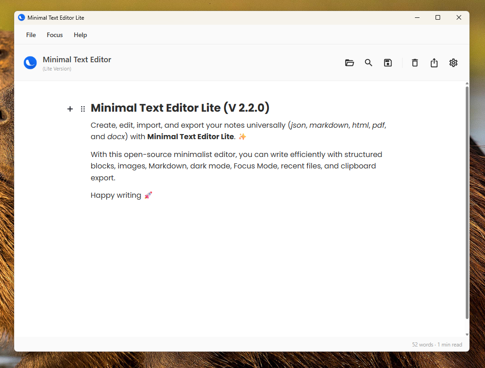
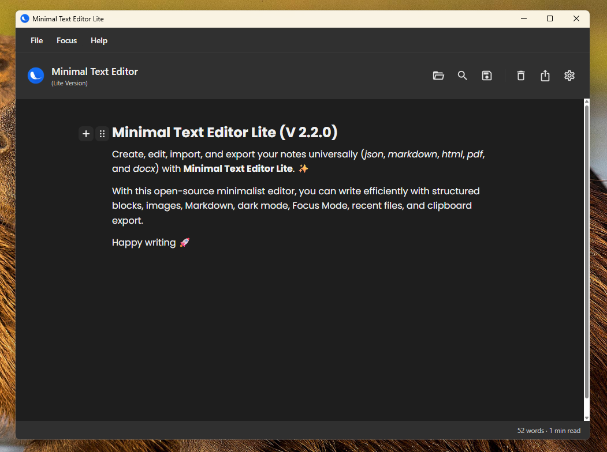
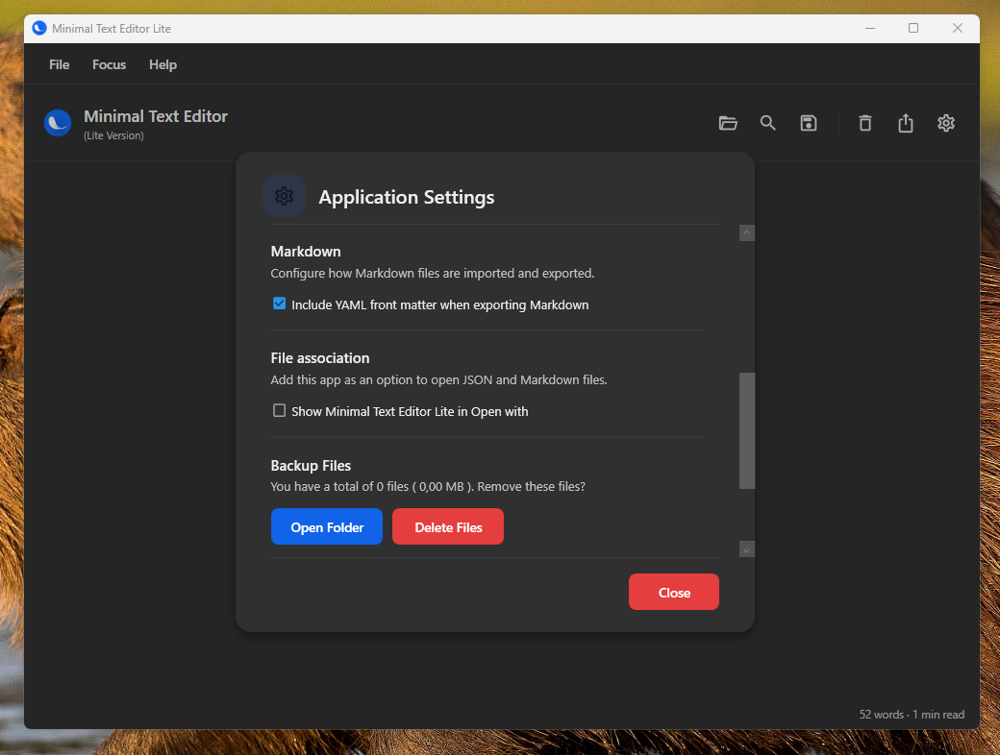

<p align="center">
  
</p>

<h1 align="center">
  Minimal Text Editor Lite For Windows (2.2.1)
</h1>

<p align="center">
  A minimalist block-based note editor for Windows.
</p>

<p align="center">
  <a href="https://micilini.com/apps/mte-lite" target="_blank">
    
  </a>
</p>

<p align="center">
  
  
  
  
  
</p>

---

> Minimal Text Editor Lite is a Windows-native note editor focused on structured writing, fast local editing, automatic saving, and clean exports to portable formats.

---

# Minimal Text Editor Lite

Minimal Text Editor Lite lets you create, edit, import, and export notes using structured Editor.js blocks.

It is designed for quick notes, documentation drafts, technical writing, study notes, article outlines, snippets, checklists, and lightweight knowledge organization.

The application stores notes locally, supports dark mode and Focus Mode, keeps recent files, exports to multiple formats, and now generates DOCX and PDF files in-process without external Python executables.

<p align="center">
  
</p>

<p align="center">
  
</p>

<p align="center">
  
</p>

## Highlights

- Block-based writing powered by Editor.js.
- Automatic local saving.
- Recent files list.
- Light mode, dark mode, and system theme support.
- Focus Mode for distraction-free writing.
- JSON import/export for portable structured notes.
- Metadata support across JSON, Markdown, HTML, PDF, and DOCX exports.
- Markdown import/export with optional YAML front matter.
- HTML export for browser-friendly documents.
- DOCX export generated in-process with OpenXML/HtmlToOpenXml.
- PDF export generated in-process through WebView2 / Chromium printing.
- Image support, including embedded base64 images.
- Clipboard export support.
- File association support for JSON and Markdown files.
- Fixed first-launch path resolution for `EditorModules/EditorJS` after installation.
- Publish output now explicitly includes EditorJS modules and language files.
- No external exporter executables required since version 2.1.0.

## Supported Editor Blocks

Minimal Text Editor Lite currently supports these note blocks:

| Block | Description |
|---|---|
| Headers | H1 to H6 document headings |
| Paragraphs | Rich inline text with basic formatting |
| Images | Embedded or linked images |
| Checklists | Task-style items |
| Lists | Ordered and unordered lists |
| Quotes | Highlighted quote blocks |
| Warning blocks | Attention or callout blocks |
| Code blocks | Monospace code sections |
| Tables | Structured tabular content |
| Links | Clickable hyperlinks |
| Delimiters | Visual content separators |
| Raw HTML | Sanitized inline HTML where supported |

## Export Formats

| Format | Status | Notes |
|---|---|---|
| JSON | Supported | Exports document plus structured metadata envelope since 2.2.0 |
| Markdown | Supported | Includes optional YAML front matter from metadata |
| HTML | Supported | Browser-friendly output with document metadata |
| DOCX | Supported | Generated in-process with OpenXML/HtmlToOpenXml and internal file properties |
| PDF | Supported | Generated in-process with WebView2 / Chromium and visible document metadata |

## Metadata Support

Minimal Text Editor Lite includes a metadata panel available through:

```text
File > Metadata
```

The metadata fields are stored with the current note:

- Title
- Slug
- Tags
- Publish date

Starting with version 2.2.0, metadata is reused across the export pipeline:

| Export | Metadata behavior |
|---|---|
| JSON | Exports a `metadata` object together with the Editor.js document |
| Markdown | Uses metadata as YAML front matter |
| HTML | Adds `<title>`, metadata tags, and a visible metadata block |
| PDF | Prints the visible metadata block through the WebView2 PDF pipeline |
| DOCX | Adds visible metadata and Word document properties such as title, subject, keywords, and created date |

Legacy Editor.js JSON files are still supported on import.

## Architecture Overview

```text
Editor.js WebView2 UI
        │
        ▼
WPF application layer
        │
        ▼
Core services
        ├─ ImportService
        ├─ ExportService
        ├─ BackupService
        ├─ SettingsRepository
        └─ RecentFilesRepository
        │
        ▼
Exporters
        ├─ JsonExporter
        ├─ MarkdownExporter
        ├─ HtmlExporter
        ├─ DocExporter  ──→ HtmlDocumentBuilder ──→ HtmlToOpenXml / OpenXML
        └─ PdfExporter  ──→ HtmlDocumentBuilder ──→ WebView2PdfRenderer ──→ Chromium PDF
```

The export pipeline is centered around `HtmlDocumentBuilder`, which converts the Editor.js document model into reusable HTML. HTML, DOCX, and PDF exports share the same document-building path, reducing duplicated rendering logic.

## What Changed Since Version 2.0.0

Version 2.2.1 fixes installed-app EditorJS path resolution and explicitly includes EditorJS modules and language files in publish output.

Version 2.2.0 expands note metadata beyond Markdown. Metadata is now included in JSON exports, rendered in HTML/PDF/DOCX exports, and written into DOCX package properties where applicable.

Version 2.1.0 removes the old external exporter binaries and replaces them with in-process C# export pipelines.

### In-process DOCX Export

- Removed the runtime dependency on the old DOCX exporter executable.
- Added DOCX generation through OpenXML and HtmlToOpenXml.
- Improved export speed by avoiding external process startup.
- Improved output spacing and document readability.
- Added stronger table styling and page layout polish.

### In-process PDF Export

- Removed the runtime dependency on the old PDF exporter executable.
- Added PDF generation through WebView2's Chromium print pipeline.
- Improved heading rendering.
- Improved emoji rendering through the Chromium engine.
- Added print-friendly CSS with better page breaks.
- Preserved backgrounds for quote, warning, and code blocks.

### Security and Distribution

- Removed PyInstaller-based exporter binaries from the application runtime.
- Reduced false-positive antivirus risk from external executable exporters.
- Simplified local build and distribution.

## How to Run Locally

Requirements:

- Windows 10 or 11 x64
- Visual Studio Community 2022 or newer
- .NET 8 SDK
- .NET desktop development workload
- WebView2 Runtime installed on Windows

Steps:

1. Clone the repository.
2. Open the solution file in Visual Studio.
3. Restore NuGet packages.
4. Build and run the WPF application with `F5`.

DOCX and PDF export are generated in-process. No external Python executables are required.

## Built With

- C# / .NET 8
- Windows Presentation Foundation (WPF)
- WebView2
- Editor.js
- React
- SQLite
- HtmlToOpenXml
- HtmlSanitizer
- Markdig
- ReverseMarkdown
- MaterialDesignThemes
- CommunityToolkit.Mvvm

## Version History

### Version 2.2.1

Patch release focused on installed-app reliability. This version fixes the EditorJS module path resolution used by the WPF/WebView2 editor, preventing the application from looking for `EditorModules/EditorJS` in the wrong working directory when launched by an installer or external process. The publish configuration now explicitly includes `EditorModules` and language files in the published output.

### Version 2.2.0

Expands note metadata support across export formats. JSON now exports a structured package with metadata plus the Editor.js document, JSON import remains backward-compatible with legacy Editor.js files, and HTML, PDF, and DOCX exports can include visible document metadata. DOCX also writes metadata into internal Word document properties.

### Version 2.1.0

Major export pipeline update. Replaces external DOCX/PDF exporter executables with in-process C# exporters, adds WebView2-based PDF generation, improves DOCX output readability, removes PyInstaller exporter runtime dependencies, and updates the project presentation.

### Version 2.0.0

Adds a more complete note workflow with dark mode, Focus Mode, recent files, Markdown/front matter improvements, clipboard export, image support, and broader import/export behavior.

### Version 1.0.0

Initial public version of the lightweight Windows note editor.

## Historical Exporter Repositories

Earlier versions used external Python executables for DOCX and PDF export.

Those standalone repositories are still available as independent projects, but this application no longer consumes them at runtime.

- [ExportAsDoc](https://github.com/micilini/ExportAsDoc)
- [ExportAsPDF](https://github.com/micilini/ExportAsPDF)

## Translation

Minimal Text Editor Lite supports application-level translations through JSON language files.

To add a new language:

1. Create a new JSON file inside the `Languages` folder.
2. Translate every key from the existing language files.
3. Add the new option to the settings language selector.
4. Update the language handling logic if needed.
5. Test the app and submit a Pull Request.

Note: Editor.js block content itself is not automatically translated.

## Contributing

Want to improve Minimal Text Editor Lite?

You can open issues for bugs, improvements, translations, documentation updates, or feature suggestions. Pull Requests are welcome.

## License

This project is open-source and available under the MIT License.
